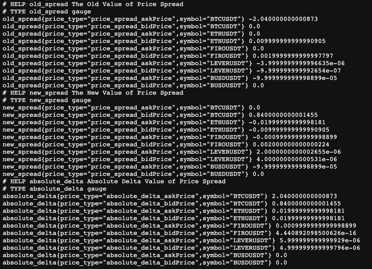

[](https://www.python.org/downloads/)
[](https://binance-connector.readthedocs.io/en/stable/)
[](https://black.readthedocs.io/en/stable/)

# Binance Assignment

- Use public market data from the SPOT API at https://api.binance.com
- Binance API spot documentation is at https://github.com/binance-exchange/binance-official-api-docs/
- All answers should be provided as source code written in either Go, Python, Java, Rust, and/or Bash.

## Questions:
1. Print the top 5 symbols with quote asset BTC and the highest volume over the last 24 hours in descending order.
2. Print the top 5 symbols with quote asset USDT and the highest number of trades over the last 24 hours in descending order.
3. Using the symbols from Q1, what is the total notional value of the top 200 bids and asks currently on each order book?
4. What is the price spread for each of the symbols from Q2?
5. Every 10 seconds print the result of Q4 and the absolute delta from the previous value for each symbol.
6. Make the output of Q5 accessible by querying http://localhost:8080/metrics using the Prometheus Metrics format.

## Installation

Make sure you had:
1. [Python3](https://www.python.org/downloads/)
2. [Pip3](https://pip.pypa.io/en/stable/installation/)
3. Install requirements.txt
```
pip3 install -r requirements.txt
```

## How to run it
```
python3 binance_producer.py
```

## Why is python?

I was considering to choose Go/Python/Bash script to do this task. Anyway, I decided to go with Python because we have the official [binance-connector-python](https://github.com/binance/binance-connector-python) library
It's easy for me to use Binance APIs also we had a lot of libraries to support for coding.

## Prometheus metrics:

Please visit [localhost:8080/metrics]() to see the metrics



## Grafana dashboards (optional)

In case we want to visualize Prometheus metrics from Q6. I made the docker-compose file for them.

### Prerequisites:

* Docker Engine >= 1.13
* Docker Compose >= 1.11

Build docker-compose
```
docker-compose build
```
Start docker-compose
```
docker-compose up
```

Clean up
```
docker-compose down --volumes --remove-orphans
```
Binance Dashboard

